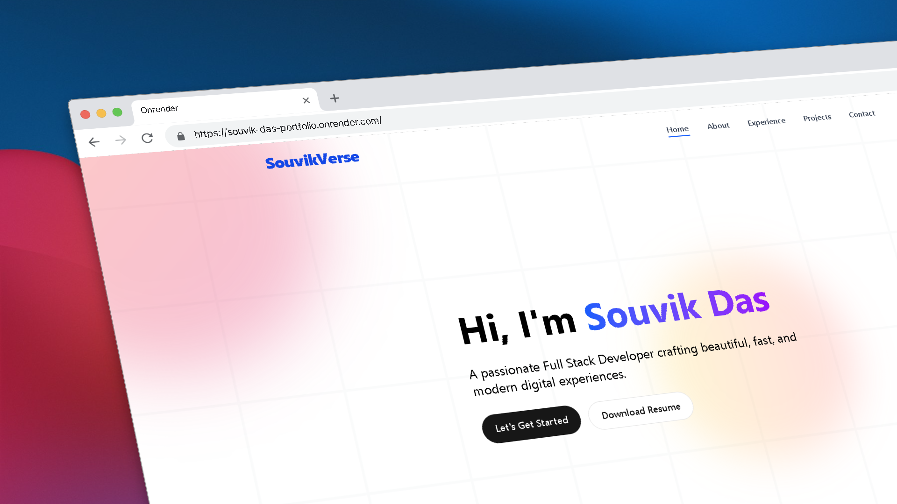

# 💼 Developer Portfolio Projects Showcase

This is a sleek, responsive, and modern **Projects Showcase Section** built with **React** and **TailwindCSS**. It highlights multiple full-stack and frontend projects with live demo links, GitHub repos, tech stack badges, and beautiful hover effects.

---

## ✨ Live Demo

🔗 [View Live Portfolio](https://souvik-das-portfolio.onrender.com)

> Deployed using ```Render```

---

## 📸 Screenshot



> Add a screenshot of your section in the `/public` folder and name it `preview.png`

---

## 🛠️ Projects Featured

### 📦 1. Food Delivery App
> **Stack:** MERN (MongoDB, Express, React, Node.js)

A full-featured food delivery web app with user authentication, cart, checkout, admin panel, and payments.

- 🔧 **Tech:** React, Redux, Node.js, Express.js, MongoDB, JWT, Stripe, TailwindCSS
- 🔗 [GitHub](https://github.com/Souvikdas040/food-delivery-app) | [Live Demo](https://food-delivery-app-url)

---

### 😂 2. Fun Fact Generator
> **Stack:** React + APIs

A fun interactive app that fetches random cat facts, jokes, and advice from public APIs on refresh.

- 🔧 **Tech:** Vite, React, TailwindCSS, CatFact API, Official Joke API, Advice Slip API, Useless Facts API
- 🔗 [GitHub](https://github.com/Souvikdas040/fun-fact-generator) | [Live Demo](https://fun-fact-generator-url)

---

### ☀️ 3. Weather App
> **Stack:** React + TypeScript + OpenWeather API

A beautiful weather app that displays current weather, 7-day forecast, and supports dark mode.

- 🔧 **Tech:** React, TypeScript, TailwindCSS, Lucide Icons, Framer Motion, OpenWeather API, date-fns
- 🔗 [GitHub](https://github.com/Souvikdas040/weather-app) | [Live Demo](https://weather-app-url)

---

## 🧠 Key Features

- 🧩 Modular Project Cards
- 🌐 External GitHub + Demo Links
- 💅 Responsive Layout (Mobile, Tablet, Desktop)
- 🌓 Light & Dark Mode Friendly
- 💻 Clean & Maintainable Codebase

---

## 🏗️ Tech Stack

- [React](https://reactjs.org/)
- [Tailwind CSS](https://tailwindcss.com/)
- [Lucide Icons](https://lucide.dev/)
- [Framer Motion](https://www.framer.com/motion/)
- [Vite](https://vitejs.dev/)
- [TypeScript](https://www.typescriptlang.org/) (optional, for TS-based projects)

---

## 📁 Folder Structure
```kotlin
souvik-das-portfolio/
├── public/
│ └── preview.png
├── src/
│ ├── components/
│ │ └── ProjectCard.tsx
│ ├── pages/
│ │ └── Projects.tsx
│ └── App.tsx
├── tailwind.config.js
├── package.json
├── vite.config.ts
└── README.md
```

---

## 📦 Installation

```bash
git clone https://github.com/Souvikdas040/portfolio-projects.git
cd portfolio-projects
npm install
```

---

## 🔧 Development

```bash
npm run dev
```
>View your site locally at: ```http://localhost:5173```
